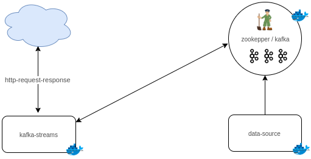

# kafka-streams-interactive-queries

With this app, I demonstrate with code how dynamically streams can be implemented leveraging kafka Streams.
The <b>Kafka Streams API</b> brought a new kafka client that enables stateless and stateful processing of incomming datas,
with state being stored internally. Kafka Streams provides <b>State Store</b>, which is continuously backed up to a Kafka topic behind the scenes.
Most typical state stores are key value stores, where the key will be on a certain partition. 

Kafka Streams supports the notion of queries across state stores. Interactive queries 
were designed to give developers access to the internal state that the Streams-API keeps <b>anyway</b>.

This app collects data from the OpenSky Network and publish them to Kafka brokers in a reactive manner where they can be 
consumed for processing.
Because kafka Strems does not provides Reactive stream processing out of the box, one way to implement resilient 
Kafka Stream application is through external libraries (laveraging, for example,reactor-kafka,vert.x)

The picture below depicts the app

